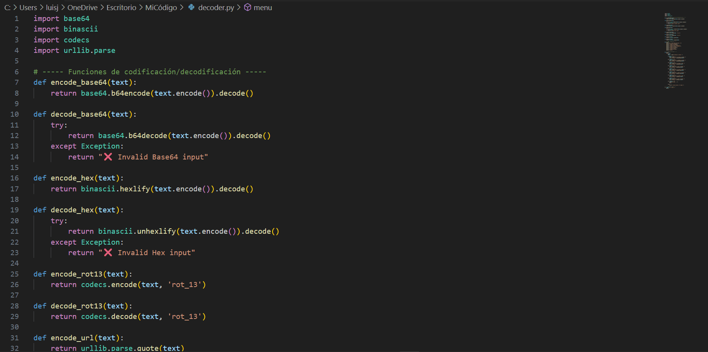

# 1uch0 @2025
# Multi-Decoder Python | Python tool to encode and decode messages with various common methods in CTF and programming:

import base64
import binascii
import codecs
import urllib.parse

# ----- Funciones Base64 -----
def encode_base64(text):
    return base64.b64encode(text.encode()).decode()

def decode_base64(text):
    try:
        return base64.b64decode(text.encode()).decode()
    except Exception:
        return "❌ Invalid Base64 input"

# ----- Funciones Hex -----
def encode_hex(text):
    return binascii.hexlify(text.encode()).decode()

def decode_hex(text):
    try:
        return binascii.unhexlify(text.encode()).decode()
    except Exception:
        return "❌ Invalid Hex input"

# ----- Funciones ROT13 -----
def encode_rot13(text):
    return codecs.encode(text, 'rot_13')

def decode_rot13(text):
    return codecs.decode(text, 'rot_13')

# ----- Funciones URL -----
def encode_url(text):
    return urllib.parse.quote(text)

def decode_url(text):
    return urllib.parse.unquote(text)

# ----- Funciones Binario -----
def text_to_binary(text):
    return ' '.join(format(ord(c), '08b') for c in text)

def binary_to_text(binary_str):
    try:
        binary_values = binary_str.split()
        ascii_chars = [chr(int(b, 2)) for b in binary_values]
        return ''.join(ascii_chars)
    except ValueError:
        return "❌ Invalid binary input"

def binary_to_decimal(binary_str):
    try:
        return int(binary_str, 2)
    except ValueError:
        return "❌ Invalid binary input"

def binary_to_hex(binary_str):
    try:
        return hex(int(binary_str, 2))
    except ValueError:
        return "❌ Invalid binary input"

# ----- Menú interactivo -----
def menu():
    print("\n=== Python Multi-Decoder ===")
    print("1. Encode to Base64")
    print("2. Decode from Base64")
    print("3. Encode to Hex (Binascii)")
    print("4. Decode from Hex (Binascii)")
    print("5. Encode to ROT13")
    print("6. Decode from ROT13")
    print("7. Encode to URL")
    print("8. Decode from URL")
    print("9. Text → Binary")
    print("10. Binary → Text")
    print("11. Binary → Decimal")
    print("12. Binary → Hexadecimal")
    print("13. Exit")

# ----- Función principal -----
def main():
    while True:
        menu()
        option = input("\nChoose an option: ")

        if option == "1":
            text = input("Text to encode in Base64: ")
            print("Encoded:", encode_base64(text))

        elif option == "2":
            text = input("Text in Base64 to decode: ")
            print("Decoded:", decode_base64(text))

        elif option == "3":
            text = input("Text to encode in Hex: ")
            print("Encoded:", encode_hex(text))

        elif option == "4":
            text = input("Text in Hex to decode: ")
            print("Decoded:", decode_hex(text))

        elif option == "5":
            text = input("Text to encode in ROT13: ")
            print("Encoded:", encode_rot13(text))

        elif option == "6":
            text = input("Text in ROT13 to decode: ")
            print("Decoded:", decode_rot13(text))

        elif option == "7":
            text = input("Text to encode in URL: ")
            print("Encoded:", encode_url(text))

        elif option == "8":
            text = input("Text in URL to decode: ")
            print("Decoded:", decode_url(text))

        elif option == "9":
            text = input("Text to convert to binary: ")
            print("Binary:", text_to_binary(text))

        elif option == "10":
            binary = input("Binary (space-separated) to convert to text: ")
            print("Text:", binary_to_text(binary))

        elif option == "11":
            binary = input("Binary number to convert to decimal: ")
            print("Decimal:", binary_to_decimal(binary))

        elif option == "12":
            binary = input("Binary number to convert to hex: ")
            print("Hexadecimal:", binary_to_hex(binary))

        elif option == "13":
            print("Exiting... 👋")
            break

        else:
            print("❌ Invalid option, try again.")

# ----- Ejecutar script -----
if __name__ == "__main__":
    main()

# Demo
# 
